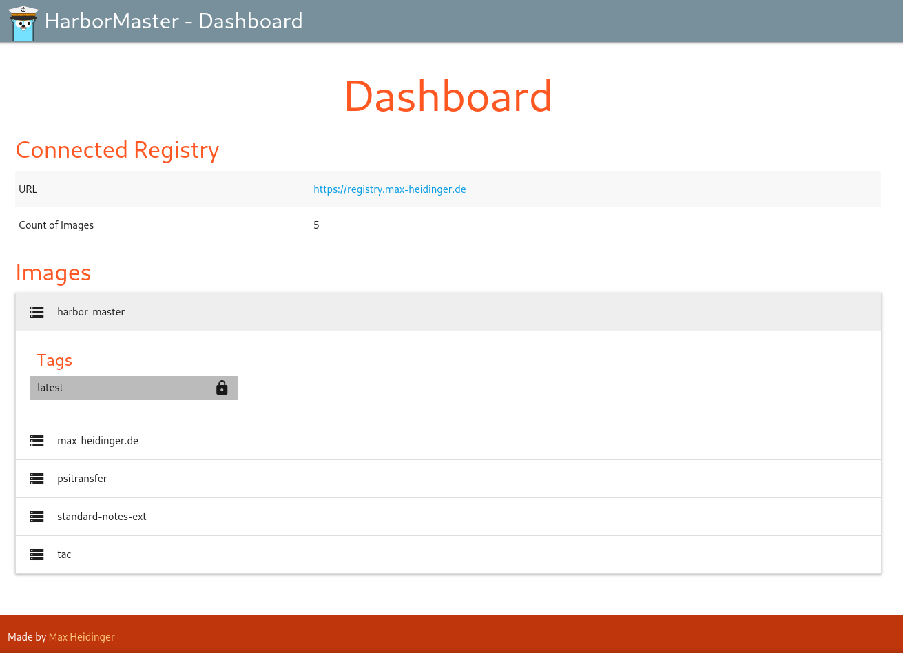

# HarborMaster


#### HarborMaster is a simple frontend for a private docker registry.

---



## Installation

### Docker

Docker images are available on [GHCR](https://github.com/users/mheidinger/packages/container/package/harbor-master).
The usage is described below.

### Compiling and running locally

For compiling the source, first download all dependencies:
```
go mod download
```

After that the compilation and execution can be done via the Makefile:
```
make
make run
```

A cleanup is also possible:
```
make clean
```

## Usage

```
./HarborMaster -help

Usage of ./HarborMaster:
  -password_file string
        Password of the docker registry (default "/run/secrets/hm_registry_password")
  -port int
        Port on which the application will run (default 4181)
  -url string
        URL of the docker registry (default "localhost:8080")
  -username_file string
        Username of the docker registry (default "/run/secrets/hm_registry_username")
```

HarborMaster does not perform any authentication itself — all routes are public. Put it behind a reverse proxy (e.g. Traefik, nginx) that handles authentication if you need access control.
